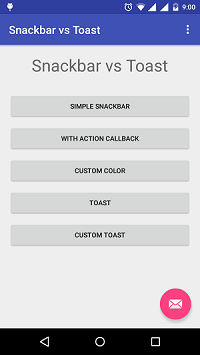
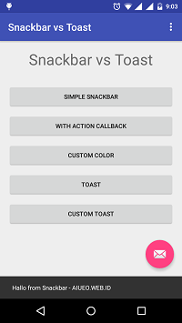
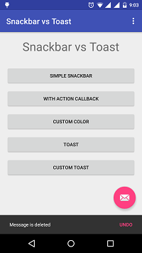
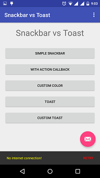
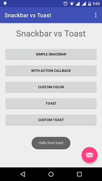

Popup Notifications Android - Snackbar vs Toast
==============================

Snackbar can be options to displaying popup notification on your Android app.

Result
--------------

References ?
--------------
<a href="https://material.google.com/components/snackbars-toasts.html">https://material.google.com/components/snackbars-toasts.html</a>
<a href="https://developer.android.com/guide/topics/ui/notifiers/toasts.html">https://developer.android.com/guide/topics/ui/notifiers/toasts.html</a>

More Question ?
--------------
ardhityawiedhairawan@gmail.com  -
